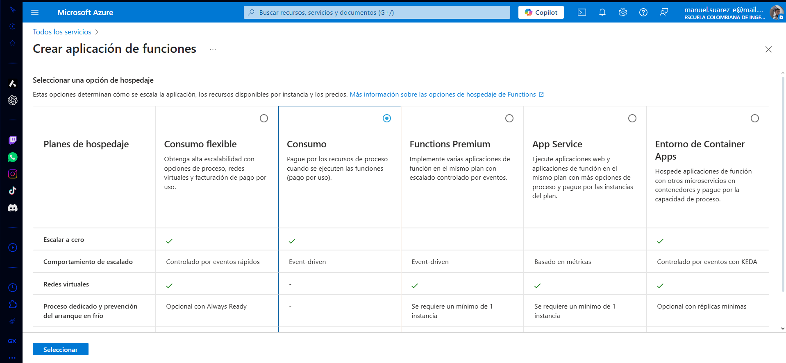
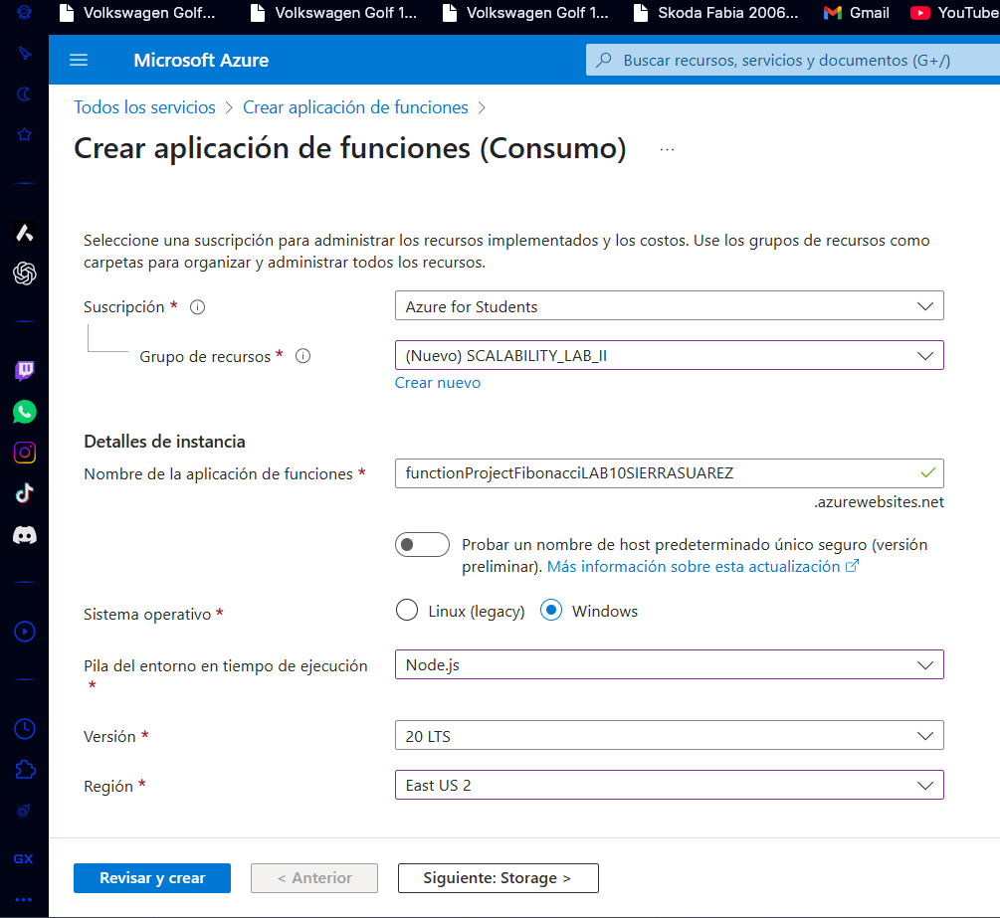
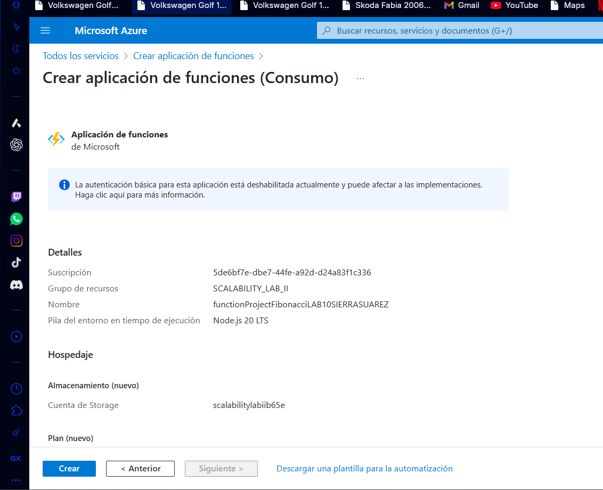
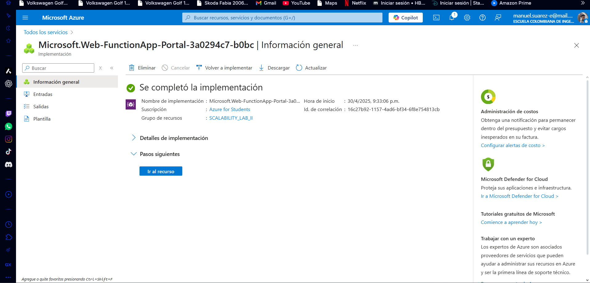
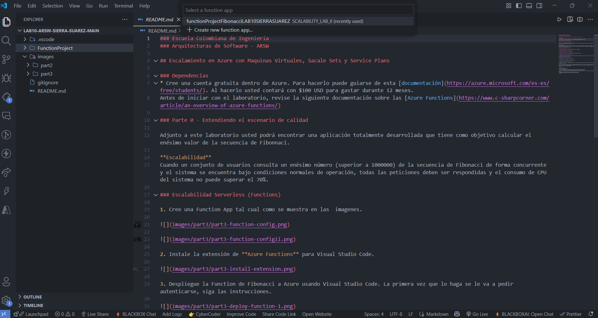
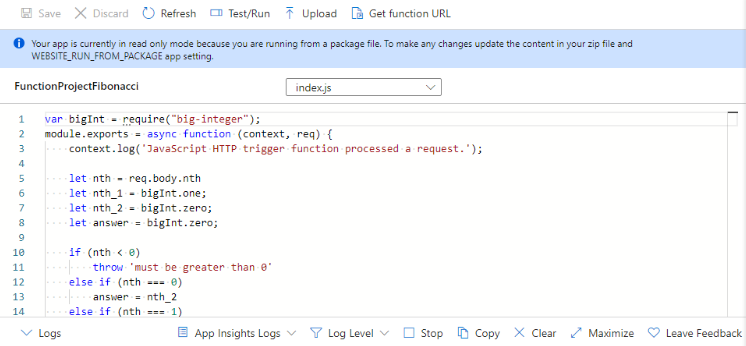

### Escuela Colombiana de Ingeniería
### Arquitecturas de Software - ARSW

## Escalamiento en Azure con Maquinas Virtuales, Sacale Sets y Service Plans

### Dependencias
* Cree una cuenta gratuita dentro de Azure. Para hacerlo puede guiarse de esta [documentación](https://azure.microsoft.com/es-es/free/students/). Al hacerlo usted contará con $100 USD para gastar durante 12 meses.
Antes de iniciar con el laboratorio, revise la siguiente documentación sobre las [Azure Functions](https://www.c-sharpcorner.com/article/an-overview-of-azure-functions/)

### Parte 0 - Entendiendo el escenario de calidad

Adjunto a este laboratorio usted podrá encontrar una aplicación totalmente desarrollada que tiene como objetivo calcular el enésimo valor de la secuencia de Fibonnaci.

**Escalabilidad**
Cuando un conjunto de usuarios consulta un enésimo número (superior a 1000000) de la secuencia de Fibonacci de forma concurrente y el sistema se encuentra bajo condiciones normales de operación, todas las peticiones deben ser respondidas y el consumo de CPU del sistema no puede superar el 70%.

### Escalabilidad Serverless (Functions)

1. Cree una Function App tal cual como se muestra en las  imagenes.

2. Instale la extensión de **Azure Functions** para Visual Studio Code.

3. Despliegue la Function de Fibonacci a Azure usando Visual Studio Code. La primera vez que lo haga se le va a pedir autenticarse, siga las instrucciones.

4. Dirijase al portal de Azure y pruebe la function.

5. Modifique la coleción de POSTMAN con NEWMAN de tal forma que pueda enviar 10 peticiones concurrentes. Verifique los resultados y presente un informe.

6. Cree una nueva Function que resuleva el problema de Fibonacci pero esta vez utilice un enfoque recursivo con memoization. Pruebe la función varias veces, después no haga nada por al menos 5 minutos. Pruebe la función de nuevo con los valores anteriores. ¿Cuál es el comportamiento?.

**Preguntas**

* ¿Qué es un Azure Function?
* ¿Qué es serverless?
* ¿Qué es el runtime y que implica seleccionarlo al momento de crear el Function App?
* ¿Por qué es necesario crear un Storage Account de la mano de un Function App?
* ¿Cuáles son los tipos de planes para un Function App?, ¿En qué se diferencias?, mencione ventajas y desventajas de cada uno de ellos.
* ¿Por qué la memoization falla o no funciona de forma correcta?
* ¿Cómo funciona el sistema de facturación de las Function App?
* Informe

# Solucion
## Imagenes
### 1

### 2

### 3

### 4 

### 5

### 6 

---------------------------
## Preguntas
### 1. ¿Qué es un Azure Function?
Azure Function es un servicio de computación de Microsoft Azure que permite ejecutar fragmentos de código ("functions") en respuesta a eventos o solicitudes, sin necesidad de gestionar la infraestructura subyacente. Es ideal para tareas ligeras y específicas como procesamiento de datos, integraciones entre sistemas, o automatización de flujos de trabajo.

### 2. ¿Qué es serverless?
Serverless (o "sin servidor") es un modelo de computación en la nube donde los desarrolladores pueden ejecutar código sin preocuparse por la administración de servidores. Aunque los servidores físicos aún existen, la infraestructura es gestionada completamente por el proveedor de nube, lo que permite a los desarrolladores concentrarse en escribir y desplegar código.

Ventajas de serverless:
- Escalado automático.
- Facturación basada en uso real.
- Simplificación del desarrollo y mantenimiento.

Desventajas:
- Latencia en "cold starts".
- Dependencia del proveedor de nube.
- Limitaciones en tiempo de ejecución y recursos.

### 3. ¿Qué es el runtime y qué implica seleccionarlo al momento de crear el Function App?
El runtime de Azure Functions es el entorno en el que se ejecuta el código de las funciones. Al seleccionar el runtime, se define el lenguaje y la versión compatibles (por ejemplo, .NET, Python, Node.js, Java). Esta elección afecta:

- Compatibilidad con bibliotecas y herramientas específicas.
- Actualizaciones y soporte a largo plazo.
- Restricciones técnicas del entorno de ejecución.

Seleccionar el runtime adecuado es clave para garantizar que el código funcione correctamente y cumpla con los requisitos del proyecto.

### 4. ¿Por qué es necesario crear un Storage Account de la mano de un Function App?
Azure Functions requiere un Storage Account porque este se utiliza para almacenar:

- Archivos de configuración y estado.
- Registros de ejecución (logs).
- Datos relacionados con colas y triggers.

El Storage Account asegura la persistencia de datos esenciales para la operación y escalado de las funciones.

### 5. ¿Cuáles son los tipos de planes para un Function App? ¿En qué se diferencian? Mencione ventajas y desventajas de cada uno de ellos.
Azure Functions ofrece tres tipos de planes:

#### 1. **Consumption Plan**
- **Descripción**: Escala automáticamente según la demanda y cobra solo por el tiempo de ejecución de las funciones.
- **Ventajas**:
  - Costos reducidos para cargas intermitentes.
  - Escalado completamente automático.
- **Desventajas**:
  - Límite en tiempo de ejecución (5 minutos por defecto, ampliable a 10 minutos).
  - Latencia en "cold starts".

#### 2. **Premium Plan**
- **Descripción**: Ofrece escalado automático con mejor rendimiento y evita "cold starts".
- **Ventajas**:
  - Sin límite de tiempo de ejecución.
  - Siempre activo (sin "cold starts").
  - Conectividad avanzada a redes virtuales.
- **Desventajas**:
  - Mayor costo comparado con el Consumption Plan.

#### 3. **Dedicated (App Service) Plan**
- **Descripción**: Permite ejecutar funciones en servidores dedicados.
- **Ventajas**:
  - Control completo sobre la infraestructura.
  - Ideal para escenarios con carga constante.
- **Desventajas**:
  - No escala automáticamente.
  - Costos más altos debido a la infraestructura fija.

### 6. ¿Por qué la memoization falla o no funciona de forma correcta?
La memoization puede fallar por varias razones:

- **Datos de entrada mutable**: Si los argumentos usados como clave cambian después de ser almacenados, la función devolverá resultados incorrectos.
- **Configuración incorrecta**: Una implementación mal diseñada puede no manejar correctamente las claves o los valores.
- **Falta de persistencia**: Si el almacenamiento de memoization es volátil o no persiste entre ejecuciones, se perderán los beneficios.
- **Uso en entornos distribuidos**: En sistemas distribuidos, el almacenamiento en memoria local no es compartido entre instancias, lo que puede causar inconsistencias.

### 7. ¿Cómo funciona el sistema de facturación de las Function App?
El sistema de facturación depende del plan seleccionado:

- **Consumption Plan**:
  - Cobro basado en el número de ejecuciones y tiempo de ejecución.
  - Facturación por GB-segundo (cantidad de memoria usada por tiempo de ejecución).

- **Premium Plan**:
  - Cobro por instancias activas y tiempo de ejecución.
  - Incluye costos adicionales por conectividad avanzada.

- **Dedicated Plan**:
  - Facturación basada en los recursos asignados (CPU, memoria) independientemente del uso.

------------------

# Manuel Suarez - Yeltzyn Sierra
